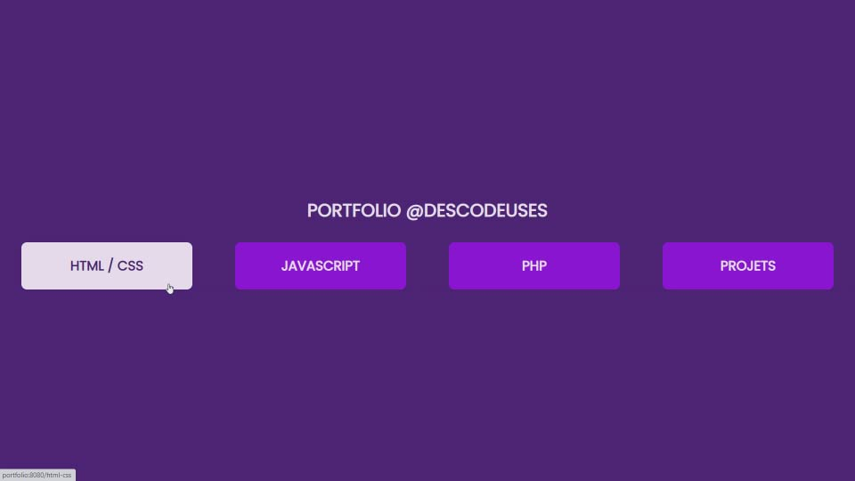
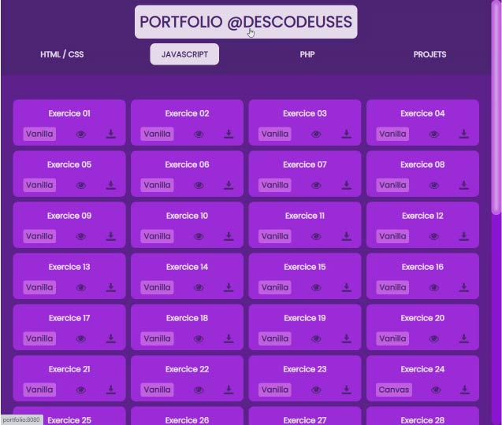
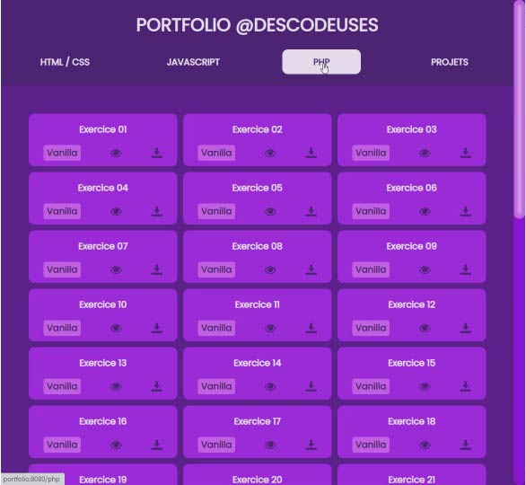
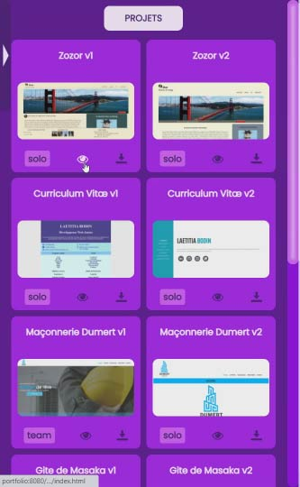
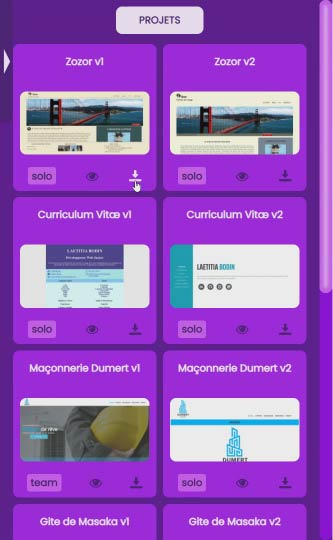
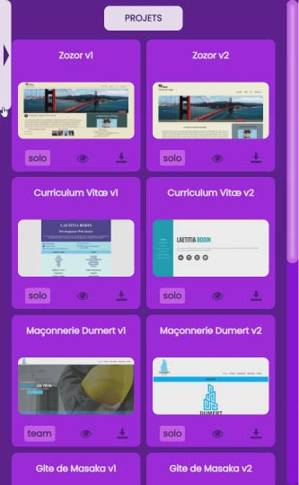

# PORTFOLIO DESCODEUSES #  

Portfolio des exercices et projets faits pendant la formation chez DesCodeuses.  

Stack : HTML, CSS (Bootstrap, Sass), Javascript (jQuery, Jasmine, Canvas) et PHP.  
Contenu : énoncés des exercices + exercices / maquettes + projets.  
Possibilité de voir les rendus et/ou télécharger les codes.  

## INSTALLATION ##  

-   Installer le dossier **node_modules** : dans le terminal, lancer la commande <code>npm install</code>.  
-   Pour voir l'application dans le navigateur : lancer la commande <code>npm run start</code>.  
    Le port par défaut est *3000*.  
    Attention, les codes PHP risquent de ne pas être lus correctement. Il est fort possible qu'en cliquant sur l'oeil pour voir l'exercice, le fichier php correspondant soit téléchargé dans le dossier de téléchargement du navigateur. Pour voir les fichiers dans le navigateur, il faut mettre l'application sur un serveur (avec **Wamp** par exemple).
-   Pour utiliser l'application sur un serveur local comme **Wamp** : lancer la commande <code>npm run build</code>, puis utiliser le dossier *build* comme racine du local host.  
    Note : les fichiers PHP vont être utilisés. Pour certains exercices, de nouveaux fichiers peuvent être créés et d'autres peuvent être modifiés. Pour garder une trace des codes d'origine, des copies des codes ont été faites en .txt (disponibles dans les dossiers à télécharger).  

## UTILISATION ##  

Les différents exercices et projets sont présentés sous forme de cartes.  
Pour chaque, il y a un badge indiquant la série, un oeil pour voir la page correspondant dans le navigateur et une flèche de téléchargement pour télécharger le dossier correspondant.  

## APERCUS ##  

Voici quelques captures d'écran :  

  
  
  
  
  
  